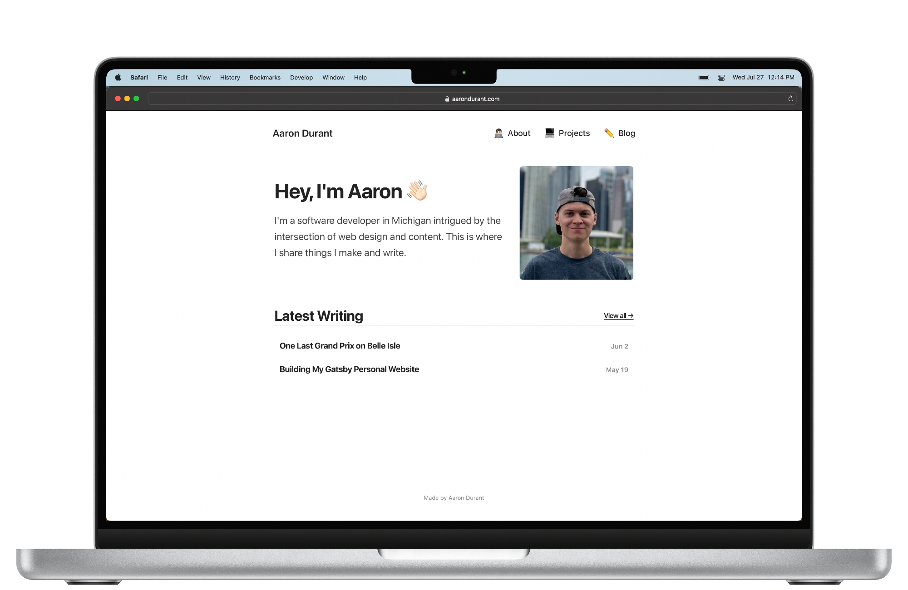

# aarondurant.com 🤘🏻

Completed in late January 2023, my website's current design marks the first revision to my little corner of the internet, which I initially launched in May 2022.

Eight months on, none of the technology behind the website has changed — it's still using the Gatsby framework, Markdown files continue to drive the blog via GraphQL, and it remains hosted on Netlify. I'm open to using a Gatsby alternative for the next redesign and always considering using a CMS for blog posts. We'll see.

I intend to stick with the current look and triple down on writing blog posts. I prefer quality over quantity but aim to produce more written pieces than I have in recent years.

## To Do ✅

Beyond adding dark mode, I'll leave the design alone until I feel ready to work on version 3.0. I anticipate going with an ultra-minimalist look in the future but am still determining how I want it to look.

## Author 👨🏻‍💻

- Aaron Durant // [aarondurant.com](https://aarondurant.com) // [@AaronRDurant](https://twitter.com/AaronRDurant)
