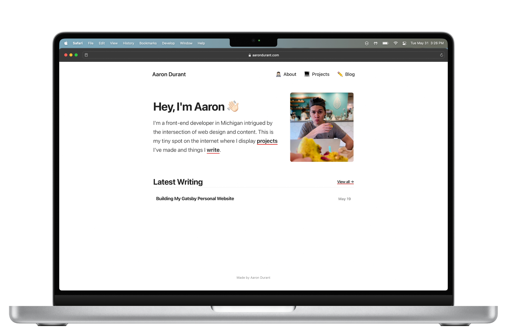

I made my first website more than 10 years ago (basically half my life). I began writing on the internet eight years ago.

Six and a half years ago, I helped create a website called [The Apex](https://www.theapex.racing/). That project led to intense skill development and put me closer to open-wheel and sports car racing than I could've dreamt of when I first witnessed it in 2007.

About 600 days ago, in September 2020, I started down the path of a career in web development when I dove into my project-based online bootcamp. By November 2021, I felt ready to take on my most exciting hand-coded website yet.

All of that — and so much more in between — leads to today, when I'm at long last able to pull the make-believe internet wraps off my blazing-fast, modern personal website! 🎉

Built with React using the framework Gatsby, this new version of aarondurant.com ends the line of WordPress-based personal websites I've maintained for the last several years. But, more importantly, it lays the groundwork for future revisions as I further my skills and continue following my interests in web development.

## Synthesizing My Experience

I wasn't starting totally from scratch when I began studying web development. The same is true for this personal website.

Every facet of the design and content of this website pulls from the opinions, skills, and even values I picked up during all the years I immersed myself in web design and content.

With The Apex, for example, I didn't want to just write about car racing. Instead, something drove me to turn over every stone relating to copywriting, content structure, website organization, marketing, etc. Boosted by tons of research about media business models, I realized I had given myself an accelerated journalism degree. As a result, I developed competencies in areas traditional university classes will never touch.

I applied my experience to produce a minimalistic personal website. There are no extraneous design elements and certainly no ads or internet trackers. These aren't values you leave university or a coding bootcamp with, making this 1.0.0 version of my personal website unique.

While I don't have world-class development abilities at this stage, I feel I've benefitted from a bit of a head start due to a hard-earned philosophy about the intersection of web design and content.

I intend to write more soon about that philosophy as well as my strategy for the design and content of this website, plus what I'd like to add next.
