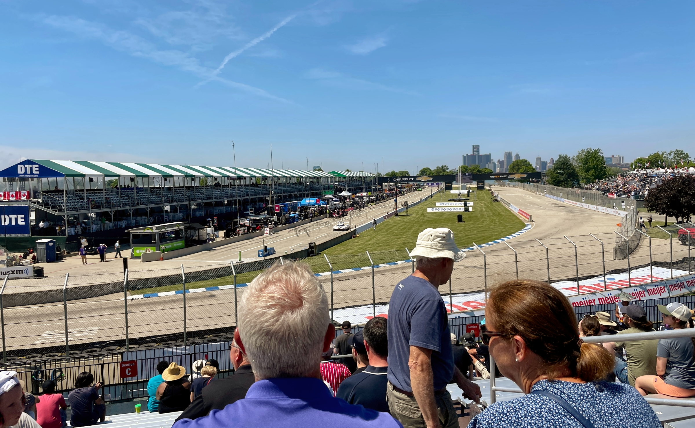

Today is a lot like Christmas Eve for me. Actually, no, it's more than that — it's like the last Christmas Eve I'm going to experience in the house I grew up in before a big move.

Obviously, we're still half a year from Christmas, so what is this momentous occasion? World-class racing's on-and-off relationship with the Raceway at Belle Isle Park, which began in 1992, ends for good this weekend.

The final Detroit Grand Prix on Belle Isle begins tomorrow before the event reappears at a new downtown street circuit a year from now. The day before this event always stirs a unique feeling, and I have much to reflect on this year.

I experienced a sense of wonder on the last day of August 2007 — the first day of the returning Detroit Grand Prix and my first time seeing open-wheel and sports car racing. That feeling led to the development of essentially every professional skill I hold a decade and a half later.

I was well aware of my desire to be as close to the action as possible, but I didn't know it would lead to...

- Several all-nighters during high school writing and working on websites
- Attending three dozen races across North America (and never losing the excitement of the Friday practice day from Detroit in 2007)
- Waiting until some middle-of-the-night hour for the start of a six-hour sports car race in Japan as one of the very few in America writing about it
- Asking questions in press conferences (including at Belle Isle) that sparked answers which drove publications like USA Today, Autoweek, and others to publish pieces, plus a [rare press conference video from IndyCar](https://www.youtube.com/watch?v=VuU1Y55VqZc)
- Interviewing Scott Dixon in the hours after he won his fifth premier open-wheel series title, tying A.J. Foyt, in gorgeous Sonoma, California, in 2018
- Trekking miles and miles on foot around the Road America circuit with photographer's access (seemingly every other photographer had at least a bicycle both years I did this) and bracing for explosive sound every time a Corvette, Porsche, or Cadillac prototype approached
- Sharing a dinner table with Pato O'Ward at Mid-Ohio before he ever drove an Indy car (he finished second at this year's Indy 500 for the Arrow McLaren SP team)
- Conducting many other interviews in racetrack garages and team transporters, challenging myself to ask worthwhile questions but pinching myself all the while
- Being introduced to America's lone Porsche factory driver Patrick Long as he set down his giant trophy and maintained a grasp on an equally large bottle of champagne awarded after racing at the Grand Prix of Long Beach
- Wondering who was calling my name in the busy Long Beach pits, 2,400 miles from home, as I waited to interview a driver (it was a former Mazda prototype driver — I was stunned!)
- Standing inches from cars on the grid mere moments before the 2018 and 2019 Indy 500, with the best drivers in the world strapped in and laser-focused on winning the Greatest Spectacle in Racing
- Witnessing Roger Penske shake the hands of several Team Penske crew members before the start of the 2019 Honda Indy Toronto — and beaming when he stopped me for a handshake and thanked me for coming to a media luncheon on the eve of the 2019 Detroit Grand Prix
- Taking multiple Ubers and walking a long way in dress shoes to finally arrive at the home of F1's United States Grand Prix, Circuit of The Americas in Austin, Texas, for IndyCar's first and so far only event there (the unbelievably fast Wi-Fi in the expansive media room was worth it alone)
- Developing relationships with walking F1 encyclopedias from Germany, photographers from England, journalists from Sweden, world-famous commentators from Australia, writers from Japan, and even IT professionals from Indianapolis 😃

... and so much more.

Every year, I hope some young person visits the Grand Prix and is impassioned just as I was. If just one person experiences awe on the island over the three days ahead, it's worth it.

My motorsports writing may not have directly led to a career, but indirectly it will. I'm so excited about what's on the horizon for me professionally, but I'm also looking forward to taking a few days to reflect on what race cars coming to Belle Isle has meant to me.

Given that it's the type of track where this all started for me, I'm a sucker for temporary street circuits like the Raceway at Belle Isle Park. If the alternative is the start of a new tradition on the streets of Downtown Detroit... I'm ready for that too. But only after this weekend.
