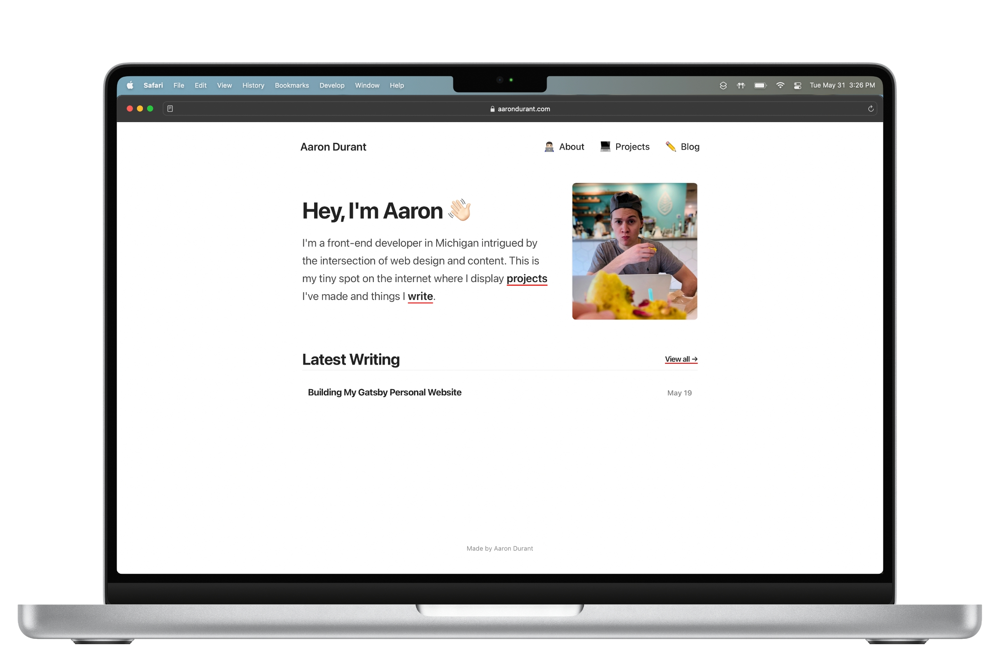

I made my first website around 10 years ago (roughly half my life). Not long after that, I began writing on the internet.

Six and a half years ago, I helped start and maintain an independent online motorsports publication called [The Apex](https://www.theapex.racing/). That project led to intense skill development and put me closer to open-wheel and sports car racing than I imagined possible when I first witnessed it in 2007.

More recently, about 600 days ago in September 2020, I started down the path of a career in web development when I dove into a project-based online bootcamp. By November 2021, I felt ready for my most exciting, crucial coding project yet.

All of that — and so much more in between — leads to today, when I can finally pull the make-believe internet wraps off my blazing-fast, modern personal website! 🎉

Built with React using [Gatsby](https://www.gatsbyjs.com), this new version of aarondurant.com ends the line of WordPress-based personal websites I've maintained for the last several years. Furthermore, it lays the groundwork for future revisions as I further my skills and continue following my interests in web development.

## Synthesizing My Experience

I wasn't starting from scratch when I began studying web development. The same was true when I started putting this personal website together.

Every facet of the design and content of this website pulls from the opinions, skills, and even values I picked up during all the years I immersed myself in matters involving web design and content.

With The Apex, for example, I didn't want to simply write about car racing. Instead, something drove me to turn over every stone relating to copywriting, content structure, website organization, marketing, etc. Boosted significantly by tons of research about media business models, I realized I had given myself an accelerated journalism degree and developed competencies in areas traditional university classes will never touch.

I applied my experience to produce a minimalistic personal website. There are no extraneous design elements and certainly no ads or internet trackers. These aren't values you leave university or a coding bootcamp with, making this 1.0 version of my personal site unique.

While I don't have world-class development abilities at this stage, I've benefitted from a head start due to a hard-earned philosophy about the intersection of web design and content.

## So What's Next?

I'm quite pleased to get this out the door and have a centralized spot to display my web development projects. However, I'm already considering how to improve this site.

First, I borrowed a lot of design and style cues from others. While I feel this is an essential step in learning, I'm not too fond of it, and I will welcome the day when I can bring a higher level of originality to my site.

Beyond that, I have some minor updates in mind. Dark mode would be cool, and some SEO work is a good idea, as are improvements to responsiveness on some device sizes.

On a macro level, the most significant advancement I can make on this site is incrementally ensuring it accurately represents everything I've done, am doing, and am going to do — that it leaves no doubt over what I'm about. This will become easier as I continue establishing myself, especially in my primary endeavors of coding and motocross.

The next step is finding somewhere to begin my development career. Finishing this new personal website was a massive stride toward that goal.
