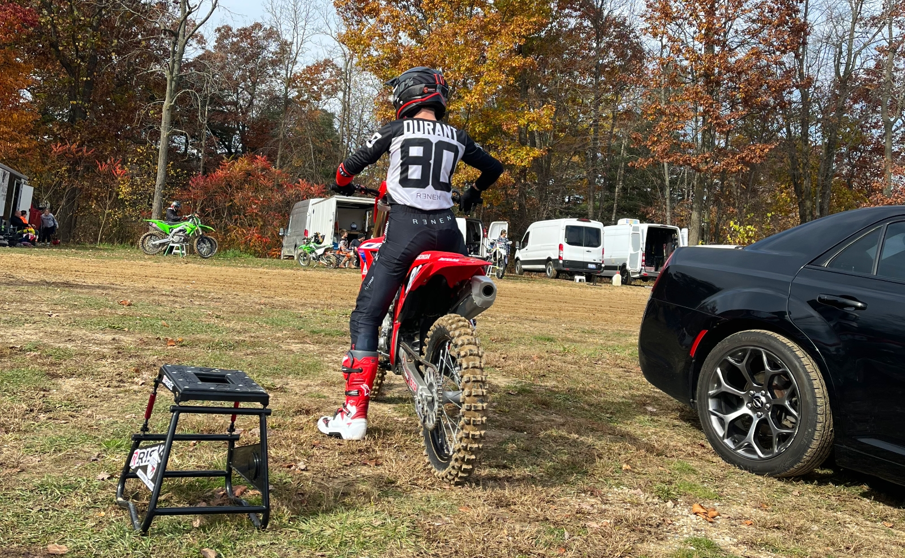
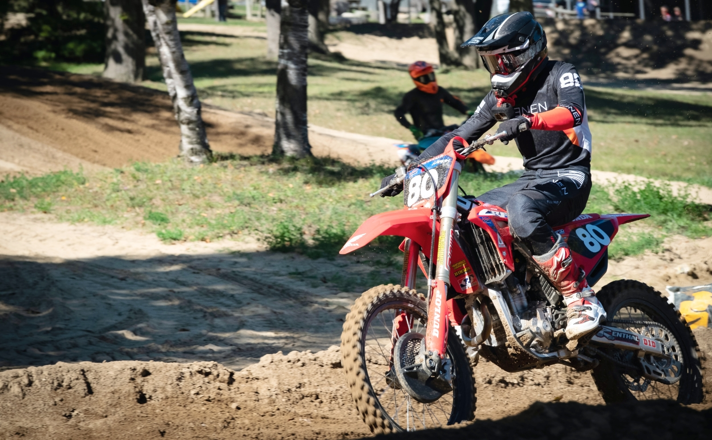
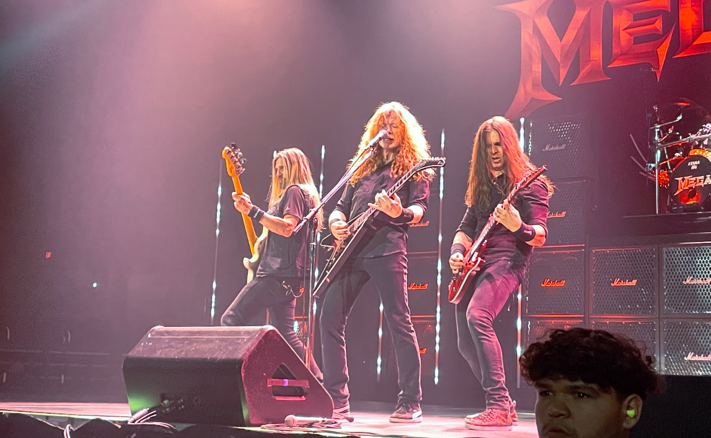

Better late than never, right?

We're three weeks into 2023, but, to my mind, this is the earliest I could've written this. Sailing aboard the Carnival Valor comprised a handful of the year's first days, and since then, I've been busy with work, working out, and having some fun times with friends.

One thing's for sure: Reflecting on what 2022 brought me leaves me much more positive than a year ago.

I felt a sharp sense of failure at the end of 2021. I was working consistently toward coding and motocross, but I still needed to land my first web development role, and I was far from bringing a dirt bike home. I despised that a whole year went by without reaching my primary goals. I was lost but determined as ever.

Last year was a different story. The only events that could make a year more substantial than 2022 for me are achieving significant career advancement, accomplishing major motocross goals, getting married, having kids, or moving across the country — things of that sort. 2022 was a big deal.

## I did a few projects

Around the year's midpoint, I was grinding out a few web development projects based on hours-long YouTube tutorials. The goal was to have some keystone projects to display on my resume and website to get my first job. It worked.

The purpose behind these websites was to learn and display my skills — not any practical use case. They're rather silly in that way. On the other hand, I have an idea or two for "real" projects I aim to work on this year.

- [Travel Mate](https://travel-mate-ad.netlify.app/)
- [brand.](https://brand-ad.netlify.app/)
- [Tech Commerce](https://tech-commerce-ad.netlify.app/)
- [Dashboard](https://dashboard-ad.netlify.app/)
- [ARMA Sport Concept](https://arma-concept-ad.netlify.app/)

## I wrote 15 things

It wasn't that long ago that I was publishing 20–30 articles each month about racing. However, writing took a backseat as I started studying web development in 2020.

Last year, I wrote the bare minimum on this website, capturing two occurrences I felt I had to. I began contributing some articles about professional motocross to MotoOnline later in the year, but not to the level I wanted to. I'm making it a point to do much better in 2023.

### Personal

- [One Last Grand Prix on Belle Isle](/last-belle-isle-grand-prix)
- [Introducing My Gatsby Personal Website](/new-personal-website)

### MotoOnline

- [Team Honda HRC makes Nichols 2023 signing official](https://www.motoonline.com/2022/10/11/colt-nichols-joins-honda-2023-supercross/)
- [Anticipated 450 transition next for Lawrence outdoors](https://www.motoonline.com/2022/09/09/anticipated-450-transition-next-jett-lawrence/)
- [Starts the focus for Lawrence in late stages of outdoors](https://www.motoonline.com/2022/08/25/starts-focus-jett-lawrence-late-stages-outdoors/)
- [ClubMX announces rider roster for inaugural WSX season](https://www.motoonline.com/2022/08/25/clubmx-announces-wsx-riders/)
- [Podium rise marks late turnaround for Roczen](https://www.motoonline.com/2022/08/24/podium-rise-late-turnaround-ken-roczen/)
- [Title challenger Sexton rues tough Budds Creek round](https://www.motoonline.com/2022/08/24/chase-sexton-rues-tough-budds-creek-round/)
- [Cairoli turns attention to MXoN following minor injury](https://www.motoonline.com/2022/08/22/cairoli-turns-attention-motocross-nations/)
- [Budds Creek impact for Mosiman upon return from injury](https://www.motoonline.com/2022/08/22/budds-creek-impact-mosiman-injury-return/)
- ['I think I'm going to get better every moto' - Wilson](https://www.motoonline.com/2022/08/17/better-every-moto-dean-wilson/)
- [Unadilla 'an example of when it's not your day' says Lawrence](https://www.motoonline.com/2022/08/16/unadilla-not-ideal-day-jett-lawrence/)
- [Arm pump the cause of Roczen troubles at Unadilla](https://www.motoonline.com/2022/08/16/arm-pump-restrains-ken-roczen-unadilla/)
- [McElrath to complete outdoor season with ClubMX](https://www.motoonline.com/2022/08/09/mcelrath-clubmx-conclude-motocross-season/)
- [Anderson, Cianciarulo to lead Kawasaki in 2023](https://www.motoonline.com/2022/08/04/anderson-cianciarulo-lead-2023-kawasaki-riders/)

## I got a job

You know that 500-year-old story about burning the ships, turning success into the only option? I brought similar conditions on myself as the second half of 2022 began.

I had tolerated more than enough at an awful job working in a fitness club cafe, and I walked away. Based on my checklist and internal sense, I was close to being "job ready" with coding, but there was no way of knowing how long I would be without income before a company took a chance on me.

It was a critical detox period from the frustrating job, but I optimized my resume, website, LinkedIn, etc. Only a week or two had passed before a few opportunities presented themselves. It finally happened as June became July, and I started on July 11.

I'm still riding the high of making this happen after opting out of college and giving those around me every reason to question my future. But, more importantly, I enjoy the work and am excited about my future in software development.

## I bought a dirt bike

On June 23, 2020, I spontaneously visited a motocross track where I grew up racing. The idea of returning to the sport landed on me like an absolute _anvil_. I had minimal income and was far from ready physically or mentally, but suddenly my life had a compelling future.

The feeling never faded. At long last, I picked up my 2023 Honda CRF250R on September 28, 2022. On October 2, 831 days removed from that day in June 2020, I had the bike, equipment, and mode of transportation sorted, and I turned my first laps in 13 years.

I asked myself for every one of those 831 days if I seriously wanted to do this. I was and am very serious — I'll never be away from this sport again.

## I rode my dirt bike 3 days

Picking up the bike in late September left little time for warm weather and, thus, riding days in Michigan. However, I want to track this over the years, so I'm starting now.

I put 7.41 hours on the bike in 2022 during these three days:

- [October 2 at Baja Acres](https://youtu.be/vx0bHlUrSGw)
- [October 16 at Baja Acres](https://youtu.be/sxHlP7vw1YM)
- [October 30 at Martin MX Park](https://youtu.be/tUiIB68m-ug)

## I did 217 workouts

That's an average of 18 per month, with a maximum of 33 in December. I've been putting in the work lately and ended the year strong!

This figure includes everything tracked as a workout on my Apple Watch Series 7, from walking to running, indoor cycling to mountain biking, yoga to weight training, snowboarding to motocross, and many others.

Here are a few key types, broken down:

- **Walking:** 34 // 79.71 miles
- **Running:** 13 // 40.08 miles
- **Weight training:** 66 // 69 hours and 9 minutes
- **Elliptical:** 12 // 11 hours and 18 minutes
- **Outdoor cycling:** 13 // 117.19 miles
- **Indoor cycling:** 32 // 19 hours and 43 minutes
- **Yoga:** 12 // 3 hours and 46 minutes
- **Snowboarding:** 5 days // 119 runs // 32.1 miles

## I went to 11 concerts

I've been fortunate to have attended so many hard-to-believe concerts over the last decade-plus, but I had an incredible time at a couple in particular in September 2021 and vowed to go to many more in 2022. I was successful.

- **April 8 at Masonic Temple in Detroit, MI:** Jack White
- **April 19 at Van Andel Arena in Grand Rapids, MI:** In Flames, Trivium, Lamb of God, and Megadeth
- **June 30 at American Family Insurance Amphitheater in Milwaukee, WI:** Chevelle, Lamb of God, and Disturbed
- **August 20 at The Fillmore in Detroit, MI:** Hatebreed, Black Label Society, and Anthrax
- **August 23 at Pine Knob in Clarkston, MI:** George Thorogood and Sammy Hagar
- **September 24 at Aragon Ballroom in Chicago, IL:** Suicide Silence, Baroness, Killswitch Engage, and Lamb of God
- **October 5 at Pine Knob in Clarkston, MI:** Fire From The Gods, The Hu, Megadeth, and Five Finger Death Punch
- **October 23 at The Fillmore in Detroit, MI:** Khemmis, Between the Buried and Me, Whitechapel, and Trivium
- **November 11 at Music Hall in Detroit, MI:** Josh Turner
- **November 25 at The Fillmore in Detroit, MI:** Cattle Decapitation, Obituary, Carcass, and Amon Amarth
- **December 9 at Token Lounge in Westland, MI:** Battlecross

## Looking Ahead to 2023

I'm so excited about this year.

The new year's cruise was an incredible way to celebrate 2022 and bring joy into 2023, and I'm generally feeling better and doing better than ever before.

The stretch from January to March is the worst part of the year. It's bitter cold, and outdoor activities are off the table. It's hard not to be impatient, especially with a new mountain bike set to show up at my door soon and a full year of motocross ahead. Still, I'm being purposeful and taking this time to over-prepare for the warmer months.

I'm building a streak of journaling and reading daily, and I've been remarkably consistent at the gym. Execution of healthy habits is coming easy right now. I already feel the best I ever have; by March, June, September — December? I'll be on another level.

I'm left to wonder for eight more weeks about the impact this will all have when I swing my leg over the dirt bike again in mid-March. I still have significant things to conquer on the bike before I have any shot at reaching my goals. I'm unsatisfied until I cross a certain threshold that I think about all day, every day.

I sense that this profound lack of fulfillment is a sign that I'll make it happen — I have to. The best part is: Nobody is telling me to push my brain and body this far, yet I do, and I will.

It's going to be a great year.
